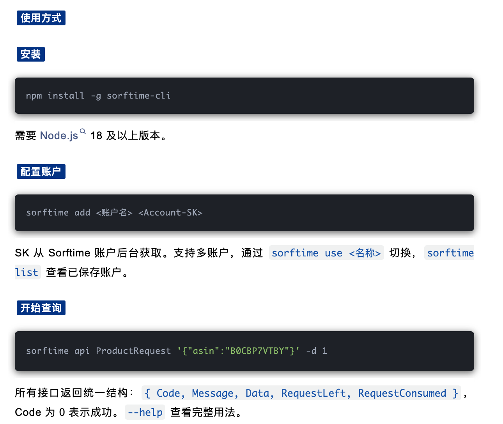
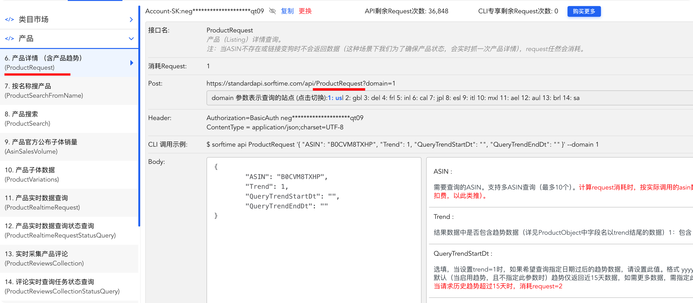

# AI 落地 · 功能扩建｜给你的工具添五个模块

[ 来自： 于新的教练圈｜亚马逊 ](https://wx.zsxq.com/group/48885112585588)

 于新

2026年08月16日 23:02

一定要做完 《分阶段验收与优化指南》，工具优化稳了，就照这个做法，把 Listing 增长诊断做出来。

今天开工。这一期做的事：把你手里的关键词作战总表，**长成一份多模块的诊断报告** ——加五个新功能：自然位标杆、否定词清单、竞对对比、图片与卖点诊断、广告诊断与优化方案。

做完之后，你输入 ASIN、填上竞对和核心词、传一份报表，出来的不再是一张表，是一份增长诊断报告——自然位、否词、竞对、图片、广告，每一块都指出来哪里还有增长空间、下一步动什么。

先说两件事。

**第一，这期跨度大，我接下来的周末都比较忙，又再一次婉拒他们的周末训练营分享邀请，所以不设周节奏** ——文章一次全给，模块作业做完一个交一个，快慢自己定。不用赶，赶出来的没质量。再一个，我觉得进度有点慢，我们可以加快些，毕竟咱们圈里很多朋友更想激发团队效率，已经广告怎么把优化这个动作系统性的去“打法”的标准化。这个我接下来会在周中发布。（周三、四、五，公司没会议我就比较闲哈哈）

**第二，还是一个模块一个模块来，别把整篇文章丢给 AI** 。上下文太长它必跑偏，这种事不能一步到位——第一次就是这么走的，很多朋友都跑偏，这一篇照旧按优化指南：每个模块里"发给 AI 的指令"都用引用格式框出来了，轮到哪个模块，把那一段发给它（复制或截图都行），做完验收，再进下一个。

* * *

## 开工：启动提示词

新开一个会话（或接着原项目会话），先把这段发给你的 AI（方括号按你自己的项目名改）：

> 读取[关键词作战总表——按你自己项目的命名]项目的相关记忆和进度记录。接下来做功能扩建：把现在的关键词作战总表，长成一份多模块的「Listing 增长诊断报告」，共六个模块（0 到 5），我会一个模块一个模块发给你，做完一个、验收一个，不许跳，也不许提前做后面的。
> 
> 全项目公共口径，先记住：
> 
> 一、报告结构：一份报告还是一个 HTML 文件。模块是报告内部的菜单分节——左侧模块菜单＋右侧内容区，手机上菜单收到顶部，模块切换用 display:none 显隐。记住：文件夹分的是工具，菜单分的是报告里的模块，前台三页（登录/工具页/报告页）的站点结构不动。
> 
> 二、数据存法：工人抓的数据按任务留底，data/任务id/ 目录下一个模块一个 JSON 文件。这个目录建在服务器上工人自己的项目目录里，是留底的中间数据，不上传文件柜。重跑某个模块，只重抓那个模块的数据，不重复调用付费接口。
> 
> 三、图片一律不下载，只存 URL。给视觉模型看图时，每张图前必须加文字标签「自己 第N张」「竞品X 第N张」，引用图片一律按标签序号，禁止自己数。
> 
> 四、数据到前端的衔接：工人把各模块的 JSON 组装渲染进报告 HTML 的对应分节——改的是工人渲染报告用的模板；报告文件照旧存文件柜、前端 fetch 在线渲染。这条链路跟现在完全一样。前台三页基本不动，唯一的例外在模块 3：工具页的发起表单要加两个输入项，到那一步我会单独发你指令，别提前动。
> 
> 五、界面：按我给你的设计规范文件来；宽表格铁律：固定列宽、表头居中、内容左对齐、外层横向滚动。
> 
> 六、付费接口纪律：西柚、sorftime 都按次计费。每个模块动手前，把预计调用量报给我确认；先小样验证，再放量。
> 
> 七、规矩照旧：不确定的问我，不许猜；先讲方案、我确认了再动手；花钱的、删东西的、改技术方案的必须先停下来问我；其余常规操作不用逐条确认，做完更新记忆文件和进度记录，给我汇总。
> 
> 八、这段收到后先别动手改任何东西。先把你对现状的理解讲给我听：工人代码在哪个目录、报告 HTML 是在哪一步生成的、现在从"接到任务"到"出报告"数据是怎么流的——三五句话说清。对上了，我再发模块 0。

* * *

## 必修前置：sorftime 怎么接（CLI 和 MCP 是两种东西，先分清）

这期要用到 sorftime（竞对详情和图片从它来）。大家基本都有账号，没有的群里问我。

**关键：sorftime 有两种接入方式，你买的是哪种就走哪条，两条的调用方式完全不同，别让 AI 猜着混用。**

怎么分：给你一条托管网址＋key 的，是 **MCP 版** ；给你装到服务器上的命令行程序的，是 **CLI 版** 。不确定自己是哪种，看后台开通页面写的是什么，或群里发我看。

分清之后，把下面对应那段发给 AI（key 先存进《[密钥库.md](http://xn--vct08dp51f.md/)》）。CLI 版多一步：把开通时官方给的安装说明找出来，跟指令一起发给 AI——装什么、怎么装照说明来，别让它猜：

> 我的 sorftime 是 MCP 版。接入方式：托管网址 [https://mcp.sorftime.com?key=我的key](https://mcp.sorftime.com/?key=%E6%88%91%E7%9A%84key) （key 在密钥库，用的时候去读，不许写进代码和回复；跟西柚的 key 一样存进工人的 .env）。调用方式跟西柚一模一样：HTTP 发 JSON-RPC，第一步先调 tools/list 把可用工具清单和参数结构存进交付目录，之后从清单里选用，不许硬编码猜工具名。工具名是小写下划线风格（如 product_detail）。返回是 SSE 包 JSON。每次跑之前先把本次预估调用次数报给我。
> 
> 现在只做接通验证，别的不做：调 tools/list 存好清单，再挑一个查询类工具用一个 ASIN 跑一次最小调用，把返回的字段结构打给我看。通了就停下，等我发模块指令。

> 我的 sorftime 是 CLI 版。接入方式：在服务器上安装 sorftime-cli（按我发你的官方安装说明装，不许猜），装完多一个 sorftime 命令，工人用子进程方式执行：sorftime api 接口名 '参数JSON' --domain 1（domain 1=美国站）。返回 JSON，Code=0 才是成功，Code 不为 0 把 Message 报给我。接口名是大写驼峰风格（如 ProductRequest），跟 MCP 版的工具名是两套体系，不许混用。注意：返回里价格类字段的单位是"分"，999 就是 9.99 美元，渲染时要除以 100。SK 在密钥库（跟西柚的 key 一样存进工人的 .env）。它有零消耗的余额查询接口（RequestStreamMonth），每次跑之前先查余额、把本次预估消耗报给我，如果不知道的字段，让我截图。
> 
> 现在只做接通验证，别的不做：照安装说明装好，跑一次余额查询，把剩余次数打给我看。通了就停下，等我发模块指令。

一句提醒：AI 每次报"预计调用 N 次"让你确认——别瞎点头。CLI 版让它先跑余额查询；MCP 版没这一手，你自己去 sorftime 后台看一眼剩多少次，心里有数再放行。

* * *

# 模块 0 · 报告骨架改造（第一件事，别的都长在它上面）

**先自查** ：打开你现在的报告页——是不是一张总表从头到底、没有模块菜单？是的话（基本人人都是），先做这个模块。再摸两样东西：一份原始广告报表（手里没有就去后台重新导一份，日期范围跟上次一致）——这个模块改完要重新跑一次任务用，你的工人跑完任务会把报表原件删掉，所以得重新传；上一篇的解析对账单当时要是没跑通，先回去补，这期靠它验收。重新跑的这一次，西柚照常按次计费——跟你平时跑一个任务一样，不是新增的口子。

**认知先摆正** ，别跟上一篇"不同功能分不同 HTML"打架：那条说的是**站点级** ——登录、工具页、报告页各是各的文件夹，这个不动。今天说的是**报告级** ——作战总表和这期加的五个功能，都是**同一份诊断报告的子模块** ，一份报告还是一个 HTML 文件，模块是报告内部的菜单。**文件夹分的是工具，菜单分的是报告里的模块。**

还有一层说破：你的报告是**工人渲染出来的 HTML 文件** ，前台 report/ 那个页面只是个壳，负责把报告取回来展示。所以这次动手改的是**工人手里的报告模板** ，壳子一行不动。以前跑出来的老报告都是存好的文件，链接照旧能打开，不用迁、不用管。

发给 AI：

> 本模块给报告做骨架改造——改的是工人渲染报告用的模板，前台三页一行不动，不加任何新的数据种类。
> 
> 一、把报告改成"菜单＋内容区"结构：左侧模块菜单，六项——01 关键词作战总表、02 自然位标杆、03 否定词清单、04 竞对对比、05 图片与卖点诊断、06 广告诊断与优化。02 到 06 先做灰色"即将上线"占位。当前模块高亮；手机端菜单收到顶部；切换用 display:none。
> 
> 二、把现有的关键词作战总表原样搬进 01 分节——数据、列、排序，一样都不许动。
> 
> 三、工人的数据存法改成分模块留底：data/任务id/ 下一个模块一个 JSON——01 总表的就叫 master-table.json，西柚的原始返回单独存一份 xiyou-raw.json，后面各模块的文件名我会随模块指令给你。每个 JSON 里带生成时间和数据来源两个说明字段，将来排查用。渲染报告时，工人按"模块 JSON→对应分节"组装：读到哪个模块的 JSON 就渲染哪个分节，没有 JSON 的模块保持灰色占位——这样后面每加一个模块，报告自动多亮一节，模板不用再大改。
> 
> 四、改动只落在工人这一边（数据存法＋报告模板），动手前把你打算改哪几个文件、每个文件改什么，列一张清单给我确认，确认了再写代码；写完重启工人。
> 
> 五、改完我重新发起一个任务验证（报表我重新上传）：新报告要出菜单骨架、总表进 01；解析对账单照旧跑，原表合计与聚合合计差值必须为零，把对账单结果和新报告链接一起发我——这是验证改造没弄丢数据。

**验收** ：新报告有菜单，01 里的总表列结构和排序跟改造前一致、对账单为零（西柚侧的数字隔了几天重抓会有小变化，正常，不算丢），02-06 灰色占位在，手机上不挤。

* * *

# 模块 1 · 自然位标杆

**业务逻辑** ：接开工帖的货架位次——每个词一张考卷，货架排的是这张考卷的分。这个模块回答一个问题：**核心词下，我的自然位离"考得最好的那个人"差多远** 。这也是判断"广告一撤会不会掉"的依据：自然位站住了的词和全靠广告顶着的词，是两种打法。

数据用工人已经在调的西柚数据——你总表每个词本来就抓了"该词点击前三的 ASIN、各自的位次和主图"（西柚那个关键词下 ASIN 分析的返回里都有），模块 0 重跑的那次已经按模块留了底。**不需要新接口，零新增花费** ——让 AI 直接用留底数据。

发给 AI：

> 给报告加 02 自然位标杆模块。数据用 data/任务id/ 留底里的西柚返回（关键词下 ASIN 分析那份），不调新接口。先说清数据长什么样：留底里每个词对应一串 ASIN 条目——我自己的 ASIN，加该词点击前三的竞对，每条各带位次信息（ranks）和主图 URL。下面要取的东西全从这串条目里来。
> 
> 一、对每个词取三样：我的自然位——我自己那条 ASIN 的 ranks 里，位置码为 or 的最小 totalRank（查不到＝未上榜，显"—"，不是 0）；标杆——那几家竞对条目里，挑自然位最靠前的非自己 ASIN，记下它是谁、位次多少。标杆只从已抓的竞对里挑，不另查全货架；我的广告位——我自己 ranks 里 sp/sb/sbv 的最小 totalRank（同样查不到显"—"）。
> 
> 二、表格列：关键词｜我的自然位｜我的广告位｜标杆 ASIN（带缩略图，用留底里的图片 URL）｜标杆自然位｜差距。差距＝我的自然位减标杆自然位，正数就是我落后的位数。按差距从小到大排——越靠上的词离标杆越近，是最有机会先拿下的。
> 
> 三、注意口径：traffic 是西柚的流量热度估值，本模块不用它下结论；未上榜的词不参与差距计算，排序时排最后，差距列显"—"。
> 
> 四、动手顺序：先从留底数三个数报给我——总共多少个词、多少个词取得到我的自然位、多少个词有标杆。数字对得上常识（比如不该是 0），我点头，你再写渲染。
> 
> 五、数据存 data/任务id/organic-rank.json，渲染进 02 分节，点亮菜单，把新报告链接发我。

**验收** ：抽一个词到西柚后台对位次——后台不方便对的，开无痕窗口直接搜这个词，肉眼数自己排第几（抓取有时间差，位次差几名正常）；再抽一个未上榜的词确认显"—"。

**作业（#AI落地 单独发帖）** ：从你的标杆表里挑 3 个词，每个词写一句判断——这个差距该用广告去补，还是先修 Listing？为什么。

* * *

# 模块 2 · 否定词清单

**业务逻辑** ：把总表从"看"变成"动作"。这个模块**只做一件事：找出哪些词该否** 。怎么投、怎么调预算，是模块 5 的事，这里不碰。

数据全部来自你自己的广告报表聚合结果，不调外部接口，零花费。

发给 AI：

> 给报告加 03 否定词清单模块。数据全部来自总表的聚合结果（每个搜索词的点击/花费/订单那份），不调外部接口。CVR 现算：CVR＝订单÷点击。
> 
> 一、三类候选，从数据里筛：  
> 第一类，点击不少、一单没有——点击超过门槛且订单为 0；  
> 第二类，转化低、花费高——CVR 低于线且花费排前列；  
> 第三类，跟产品明显不相关的搜索词——这类单独列出来，逐个让我确认，不许直接判。  
> 门槛数值：我给你的用我给的；我没给，先按"点击 15 次、CVR 2%"起草；"花费排前列"先按"花费排进所有词的前 20%"起草。起草的都标注清楚是起草值，让我改。
> 
> 二、每条候选一行：词｜点击｜花费｜订单｜CVR｜建议（精准否定／词组否定／慎否）｜一句话理由。可能带关联流量的词（跟产品沾边但表现差的）一律标"慎否"，不许直接建议否定。
> 
> 三、词根级否定单独一小节：把候选词按空格拆成单词来统计（the/for/with 这类虚词不算），只列出现在 2 条以上候选里的词根（比如好几条坏词都带 holder，holder 就是词根），每个词根附上它命中的候选词，并加提示——词根否定的实际操作是把这个单词做词组否定，所有含它的搜索词都会被拦下，杀伤面大，必须我人工确认。
> 
> 四、只出清单，不执行：报告里除了表格，另生成一个可复制的纯文本框——按广告后台能直接粘贴的样子排，精准否定一段、词组否定一段，一行一个词，"慎否"和"待确认"的不进这个框。去广告后台点操作的永远是我。
> 
> 五、动手顺序：先把三类候选各筛出多少条报给我，我看数量合理再渲染——几百条说明门槛太松，0 条说明筛法有问题，都先停下来跟我对。
> 
> 六、数据存 data/任务id/negatives.json，渲染进 03 分节，点亮菜单，把新报告链接发我。

**验收** ：抽 2 条候选回原始报表核对数字；"慎否"和"不相关待确认"两类没有被自动判死。

**作业** ：贴你的否词清单，每条带一句你自己的理由——AI 给的理由不算，你得说得出为什么。

* * *

# 模块 3 · 竞对对比

**业务逻辑** ：接被选中篇的"前排凭什么"。把散在各个词里的竞对收拢成一张档案表——3 到 5 家就够，贪多看不过来。这张表同时是下一个模块（图片诊断）的图片来源。

这个模块还要动一次工具页——全期唯一动前台的地方。道理想明白：你挑定的竞对名单得有个正经的家。存在跟 AI 的聊天记录里，工人看不见；写死在代码里，换个品就得改代码。正确的家是**发起任务的表单** ——工具页加一个竞对 ASIN 输入区、一格核心关键词，往后换品重跑，填表就行，不用再跟 AI 对话。我的诊断工具发起页就是这个思路：ASIN 一行一个、标"自己/竞对"，核心词单独一格。

发给 AI：

> 给报告加 04 竞对对比模块，竞对 3 到 5 家。
> 
> 一、候选名单从数据里出：拿 02 用的那份留底，统计每个竞对 ASIN 在所有词里出现的总次数（在某个词的点击前三里出现一次算一次），按次数从高到低给我 8 到 10 个候选——每个带主图缩略、出现次数、出现在哪几个词。我从里面挑定 3 到 5 家，你再动手，不许自己替我定名单。
> 
> 二、给工具页的发起表单升级（全期唯一动前台的地方）：ASIN 输入改成可加行的列表，每行一个 ASIN、旁边标"自己／竞对"；再加一格"核心关键词"（选填，不填工人就用总表里流量第一的词）。任务表加对应字段，工人从任务里读这两样；老任务没这些字段要照旧能跑，不许报错。改完我把挑定的竞对填进表单、重新发起任务——西柚留底还在不重调，这次只补抓 sorftime 的数据。
> 
> 三、数据两层：第一层用留底西柚返回里的竞对信息——关键词下 ASIN 分析那份里就有价格/评分/星数/自然位/流量值，不用再调；第二层用 sorftime 的产品详情接口按 ASIN 批量补厚——月销、上架日期、BSR、评分分布、变体数、有没有视频/A+/旗舰店、主副图 Photo 数组。我自己的 ASIN 也一起传给 sorftime（要拿我的 Photo 数组），所以调用量按"竞对数＋1"算。MCP 版工具名从 tools/list 清单里找 product 详情类；CLI 版接口名是 ProductRequest（可一次传多个 ASIN，逗号分隔，按 ASIN 数计费）。动手前把预计调用量报给我确认。
> 
> 四、🔴 sorftime 返回里的 Profit、ProfitRate 字段不许用、不许渲染进报告——它不含采购、头程、广告成本，是假高的利润数，谁看谁被误导。
> 
> 五、图片只存 URL：把每家的 Photo 数组（主图＋全部副图）连同"哪个 ASIN、第几张"存进 data/任务id/competitors.json，我自己 ASIN 的一并存——下个模块要用，这个模块的报告里不用展示图片，存好就行。
> 
> 六、呈现：一行一竞对的档案表，列——ASIN（带主图缩略）｜价格｜星级｜评分数｜月销｜上架日期｜BSR｜变体数｜视频/A+/旗舰店（有没有）｜图片张数。我自己的行放最上面当对照。渲染进 04 分节，点亮菜单，把新报告链接发我。价格字段注意 CLI 版单位是分，除以 100 再显示。

**验收** ：工具页表单能加行、能标自己／竞对，随便打开一个老任务不报错；抽一家竞对到亚马逊前台核对价格和评论数；图片数让 AI 把每家的 URL 条数直接打印给你对，不用自己去翻 JSON 文件。注意前台会折叠一部分副图、视频位不算图——JSON 比前台肉眼数出来的多一两张是正常的，少了才有问题。

**作业** ：每家竞对写一句——"它最硬的一张牌是什么"。

* * *

# 模块 4 · 图片与卖点诊断（重头戏）

**业务逻辑先回一课** ：转化篇讲的那套，就是这个模块的引擎——

  * 你作业里推导的**确认清单** （读人→买家下单前必须确认的 5 件事→拿前排主图和差评校对），就是诊断的判断标准；

  * 你作业里逐条标的"画面答的／文字答的／没答"，就是诊断的三种判定；

  * **主图四任务** ，就是主图单独那道检查。

当时是你拿眼睛拆一个品。现在把这套装进工具，让它替你拆每一个品——这就是"业务理解装进工具"最实在的一次。

这个模块用豆包的**视觉版模型** （能看图的那个）。不用新开账号——你密钥库里那把火山方舟的 key 就能调它，去方舟的模型广场再挑一个带 vision 的型号，名字记进密钥库，让 AI 先拿一张图跑个连通测试，通了再开工。分三步，一步一停。

开工前再备两样：

一是你转化篇作业的确认清单。作业没做的、或者当时写得糙的，别卡在这——第一步会让 AI 按三个来源直接起草，你逐条过，每条你说不出"买家为什么必须确认它"就删掉。这就算把作业补上了。

二是竞对差评。差评不走接口：你自己打开每家竞对的页面，翻 1-2 星差评的前两页，把骂得最多的三五条抱怨整理成几句话——发第一步指令的时候一起发给 AI。

发给 AI：

> 给报告加 05 图片与卖点诊断模块，用视觉版模型（密钥库里那把方舟 key，型号也记在密钥库），分三步做，每步做完停下来给我看。先说清分工和做法：第一步的确认清单在咱们对话里定，定稿存进 data/任务id/checklist.json；第二、三步看图的活是工人干的——工人调视觉模型，用 image_url 把图片地址直接传给模型（每张图配上文字标签），不下载图片文件；图片 URL 从 04 存的 competitors.json 里取。
> 
> 第一步，先定确认清单（5 到 7 条）：以我转化篇作业里写的确认清单为底稿（我没发底稿，就直接按三个来源起草），结合三个来源修订——核心词背后的购买意图、前排主图都在展示什么、竞对差评在骂什么（差评是我人工整理好随本指令发你的，不调接口）。每条要素带四样：要素名／对应的英文说法／来源（写实，比如"核心词意图""竞对差评高频"）／买家为什么必须确认它才敢下单。清单给我过目，我确认之前不许进第二步；确认了再存 checklist.json。
> 
> 第二步，看我自己的图：把我的主副图 URL 全部喂给视觉模型，一张不许漏，每张图前加「自己 第N张」文字标签。一次请求把整组图都带上；模型一次吃不下就分批，但同一条要素的判定必须建立在看完整组图之后，不许看半组就下结论。两件事：  
> 其一，主图单独过四件事——是不是白底合规无文字、扫一眼能不能认出品类、有没有呈现核心词的使用意图画面（核心词＝发起表单里填的那个，没填就用总表里流量第一的词）、画面里可见几个产品（先数再写）。  
> 其二，对确认清单逐条判：被第几张图确认（按标签序号，没确认写 0）；是"画面直给"还是"只靠小字图标"还是"整组图没答"；证据必须引用那张图里可数可读的画面元素，禁止凭印象。凡不是"画面直给"的要素，给一条具体补图建议——构图、视角、画面里放什么，具体到能直接发给美工。
> 
> 第三步，逐家竞对同框对比：把我的全部图＋该竞对的全部图一起喂（各自带标签），用同一份确认清单，两边各判一次，每条要素判"谁的图让买家确认得更快"；竞品更快更直给的，必须写"参考竞品第X张的什么做法，优化我的第Y张"。一次只对比一家，做完一家给我看一家，做完再下一家。
> 
> 铁律三条：视觉模型只做感知回答（哪张图、什么画面、有没有答），好坏和谁强的结论按上面的规则汇总，不许它自由打分；引用的图片序号必须跟证据描述的是同一张图，宁写"没确认"不许张冠李戴；每一步的调用量先报我（图片数×竞对数，心里要有数）。
> 
> 数据存 data/任务id/images.json，渲染进 05 分节：确认清单×图片的矩阵（行是要素、列是图，格子里标"第几张确认/怎么答的"）＋逐图卡片（每张图一格：标签、缩略图、它答了哪些要素）＋竞对对比建议列表，点亮菜单，把新报告链接发我。

**验收** ：随机抽两条"被第 N 张确认"的判定，打开那张图肉眼核对，证据说的画面真在那张图上；确认清单是你认过的版本。

**作业** ：贴一条"自己 vs 竞品"的要素对比，加一张你看完真打算改的图（说明改什么）。

* * *

# 模块 5 · 广告诊断与优化方案（收尾）

**业务逻辑** ：把前面所有东西串成一张"下一步动作清单"。**不搞利润成本——这是一份诊断报告，不是经营系统，投产（ACOS）加自然位就够下判断了** 。判断规矩还是你的：这个模块开工前，先把你的规矩升一级——把自然位加进去。

发给 AI：

> 给报告加 06 广告诊断与优化方案模块——收尾模块，把总表数据和 02 的自然位串成动作清单。不引入利润成本，只用投产：ACOS、花费、点击、订单、转化率，加自然位。
> 
> 一、先帮我升级判断规矩：问我三个问题，答案定稿后存成 data/任务id/rules.json，代码按它硬算，以后我改规矩就是改这个文件重跑——  
> 问题一：自然位已经进前三的词，广告降不降？降多少的条件是什么？  
> 问题二：自然位很深或者根本没上榜、但广告在出单的词，继续投还是收？  
> 问题三：ACOS 高、但自然位在往上爬的词，容忍到什么程度？  
> 我答完，你把三条答案整理成"条件→动作"的规矩复述给我确认，确认了才写代码。
> 
> 二、按升级后的规矩，对总表里的词逐个出"下一步动作"：该守／该降／该停／该加／该观察。范围说清：投过广告的词按规矩全套判；没投放的词只可能出"该加"或"该观察"。词的数据落在规矩没覆盖到的缝里、或者两条规矩打架的，单列一张"待我判"的小表，不许硬判。观察必须带退出条件（观察多久、到什么数据算结束）。每条动作一句话理由，理由必须引用具体数字（ACOS、点击、自然位），不许空话。分工写死：动作结论由代码按规矩硬算出来，豆包只把每条理由润成一句人话——不许它参与判定、不许改结论、不许规矩之外发挥。只有这样，同一份数据跑两遍结论才可能一致。
> 
> 三、呈现：动作清单表，列——词｜动作｜一句话理由（带数字）｜观察的退出条件（观察类才有）。按"先止损、再赚钱"排序（停和降在前，守和加在后），"待我判"的小表放最后。渲染进 06 分节，点亮菜单，把新报告链接发我。只建议不执行，去后台动手的是我。
> 
> 四、数据存 data/任务id/ad-plan.json。
> 
> 五、稳定性验收：同一份数据跑两遍，两遍的动作结论必须一致——不一致就是规矩没写死，回来改规矩，不是改结论。

那三个问题没有标准答案，但答的格式我给你打个样——问题一我会这么答："自然位进前三、而且连续两周稳住的词，竞价降 20%；降完出单跌超一成五，调回来。"带数字、带条件、带回撤线。照这个样子写你自己的数——写不出数的，说明还没想清楚，先想清楚再开工。

**验收** ：跑两遍结论一致；抽 3 条动作，理由里的数字回总表能对上。

**作业** ：贴 3 条动作＋你自己的理由，加一句"这次实战，我没想到的是___"。

* * *

## 收尾：启蒙完成之后

六个模块全部点亮、验收全过，这期就算走完了。

走完这期，AI 工具落地的启蒙就算完成了。你手里已经攥着一条完整的路：业务判断变成规矩，规矩变成流程，流程交给工人，工人产出报告——从密钥、服务器、接口到报告，每一环你都亲手接过一遍。

接下来需要的是你的想象力。方法就这一套，换个对象照用：想清楚判断标准→写成规矩→交给工具→自己验收。

抛个题，群里聊：**你现在运营里花时间最多的重复性工作是什么** ？每周固定要做的、步骤基本不变的、做完还得自己核对一遍的——挑一件出来，说说打算怎么把它交给工具。想法不用成熟，能把"这件事的判断标准是什么"说清楚，就是好想法。

作业还是老规矩：一个模块一帖，#AI落地，带截图。不赶进度，做扎实。
